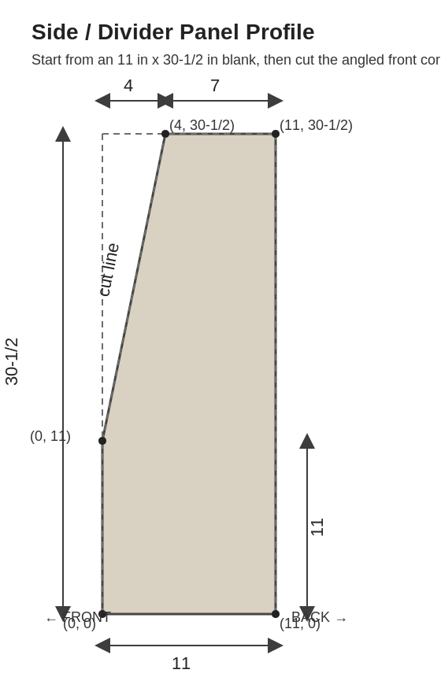
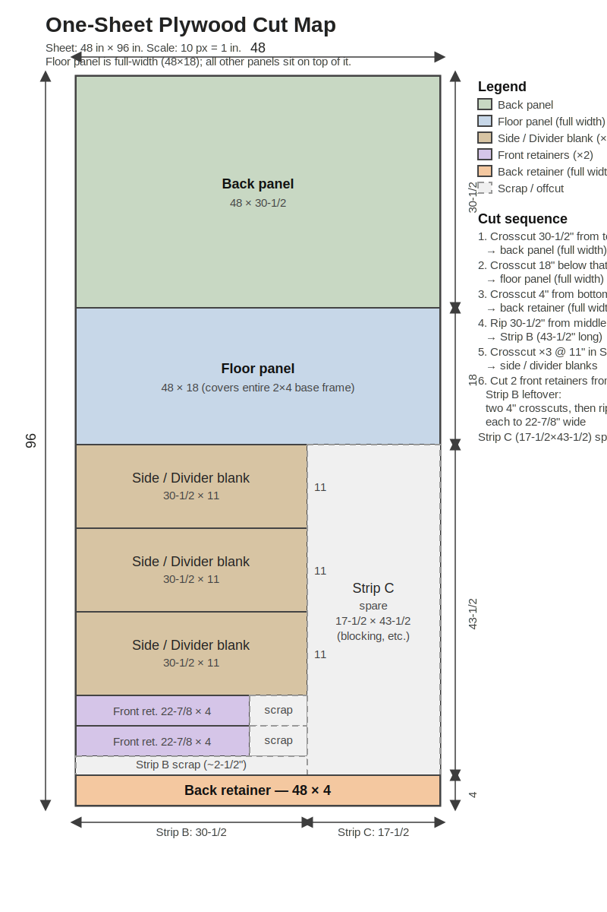
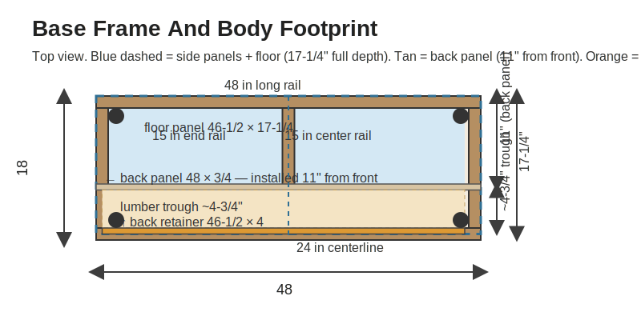

# Lumber + Plywood Cart Build Plan

This is a reverse-engineered build plan based on the reference rendering above (PinkSoul Studios × Maker Gray "Plywood + Lumber Cart"). The cart stores full sheets of plywood standing on edge plus shorter lumber, rolls on four casters, and is cut from a **single 4 × 8 sheet of 3/4 in plywood** with a **2×4 base frame**.

> **Design credit:** Alma Villalobos / PinkSoul Studios & Erin Longfellow / Maker Gray.
> This plan is an independent reverse-engineering effort and is not the official paid plan.

All dimensions are in inches unless noted.

---

## Finished Dimensions

| Item | Dimension |
| --- | --- |
| Overall width | **48** (full plywood sheet width) |
| Overall depth | **18** |
| Overall height with casters | **~39** |
| Back panel width | **48** (full sheet width) |
| Plywood panel height | **30-1/2** |
| Each bay clear width | **22-7/8** |
| Each bay clear depth | **16-1/2** |
| 2×4 base frame height | **3-1/2** (on edge) |
| Assumed caster installed height | **~5** |

Height formula: `panel height = 39 − 3.5 − caster_height`

---

## Materials and Hardware

| Material | Qty | Notes |
| --- | ---: | --- |
| 3/4 in plywood, 4 × 8 | 1 sheet | All plywood parts (see cut map) |
| 2×4 × 8 ft | 2 boards | Base frame; ~2 ft of spare left over |
| 1 in round wood dowel, 48 in minimum | 2 pieces | Two full-width bars (upper + lower) |
| Swivel plate-mount casters | 4 | 4–5 in recommended; choose locking |
| 1-1/4 in coarse wood screws | 1 box | Plywood-to-plywood assembly |
| 2-1/2 in construction screws | 1 box | 2×4 base frame |
| Wood glue | 1 bottle | All joints |
| Pocket-hole screws (optional) | as needed | Hidden fasteners if desired |

---

## Plywood Cut List

All parts from **one 48 × 96 sheet of 3/4 in plywood**.

| Part | Qty | Finished size (W × H or W × D) | Orientation note |
| --- | ---: | --- | --- |
| Back panel | 1 | **48 × 30-1/2** | Full sheet width; grain runs along the 48 in direction |
| Side / divider blank | 3 | **30-1/2 × 11** | Angled profile cut after squaring; see Side Profile section |
| Floor panel | 1 | **48 × 18** | Full cart width and full base depth — all other panels sit on top of it |
| Front retainer | 2 | **22-7/8 × 4** | One per bay; 4 in tall |
| Back retainer | 1 | **48 × 4** | Full width; sits on top of floor panel at its rear edge |

> **Geometry explained:**
> - **Floor panel is full width and full depth (48 × 18):** The floor panel covers the entire top of the 2×4 base frame. Every other panel — outer sides, center divider, back panel, and all retainers — sits **on top** of the floor. This gives a clean foundation and a continuous floor surface across the full trough area.
> - **Side/divider panels are 11" deep (front bays only):** The side and divider panels form the walls of the front bays and end at the back panel’s front face (~11" from the front). The floor continues behind them to form the open lumber trough.
> - **Back panel is NOT at the very rear.** It is installed approximately **11" from the front face**, leaving a **~5-1/2" open trough** at floor level between the back panel’s back face and the back retainer. That trough stores wider lumber (2×4s, 2×6s) flat at floor level.
> - **Back retainer (48 × 4):** Sits upright on the floor panel at the very rear edge, full cart width.

> **Verify your plywood thickness** before ripping. If it measures thicker or thinner than 3/4 in (0.75 in), adjust the front retainer width (22-7/8) accordingly.

---

## 2×4 Cut List

| Part | Qty | Length | Notes |
| --- | ---: | --- | --- |
| Long rail | 2 | **48** | Front-to-back runs the full width; laid flat under the plywood body |
| End rail | 2 | **15** | Left and right sides; fit **between** the long rails |
| Center rail | 1 | **15** | Sits directly under the center divider |

Base outer dimensions: 48 × 18 (the two 15 in end rails plus 2 × 1-1/2 in long-rail thickness = 18 in depth).

---

## Dowel Cut List

Two horizontal 1 in round bars run left-to-right through both bays. They pass through the center divider so one bar spans the entire width, keeping lumber upright and separated.

| Part | Qty | Length | Position |
| --- | ---: | --- | --- |
| Upper bar | 1 | **46-1/2** | ~21–22 in above the floor panel; supports upper portion of lumber |
| Lower bar | 1 | **46-1/2** | ~9 in above the floor panel; front stop for sheet goods |

**Alternative:** Replace each 46-1/2 bar with **two 22-7/8 bars** if you prefer not to drill through the center divider (use blind holes from each face, glued in place).

---

## Side / Divider Profile



Cut the angled front profile from each of the three 30-1/2 × 11 blanks:

1. The **back edge** stays full height at 30-1/2 in.
2. On the **top edge**, measure **4 in from the front** and mark a point (this is where the slope begins; there is a 7 in flat section at the top-back).
3. On the **front edge**, mark a point **11 in up from the bottom**.
4. Connect those two marks with a straightedge and cut the triangle away.

Use the same template / story stick for all three panels so they match.

| Corner | Depth from front (X) | Height from bottom (Y) |
| --- | --- | --- |
| Front bottom | 0 | 0 |
| Front break | 0 | 11 |
| Slope top (top edge) | 4 | 30-1/2 |
| Back top | 11 | 30-1/2 |
| Back bottom | 11 | 0 |

---

## One-Sheet Cut Map



Cut sequence for a **48 × 96** sheet (sheet is oriented with the 96 in length running top-to-bottom in the diagram):

| Step | Cut type | Where | Result |
| --- | --- | --- | --- |
| 1 | Crosscut | 30-1/2 in from one end (top) | **Back panel** 48 × 30-1/2 (full sheet width) |
| 2 | Crosscut | 18 in from same end (below back panel) | **Floor panel** 48 × 18 (full sheet width) |
| 3 | Crosscut | 4 in from the **other end** (bottom) | **Back retainer** blank 48 × 4 (full width) |
| 4 | Rip | 30-1/2 in from one long edge of the **middle** section (43-1/2 × 48) | **Strip B** 30-1/2 × 43-1/2 |
| 5 | Three crosscuts in Strip B | Every 11 in | Three **side/divider blanks** 30-1/2 × 11 each |
| 6 | Two crosscuts in Strip B leftover (~10-1/2 × 30-1/2) | 4 in each | Two **front retainer** blanks 30-1/2 × 4; rip each to 22-7/8 in |
| — | **Strip C** (17-1/2 × 43-1/2) | spare | Blocking, gussets, test cuts |

---

## Base Frame Layout



The 2×4 base is a rectangle with one centered cross-support:

1. Build the **48 × 18** outer rectangle with the two 48 in long rails (front and back) and two 15 in end rails placed between them.
2. Add the single 15 in **center rail** at the **24 in center mark**, directly under where the center divider will land.
3. Attach the four casters at the corners of the base frame.
4. The plywood body sits flush on top of the frame: the back panel's back face aligns with the base back edge; the side panel front edges align with the base front edge.

### Assembly Reference Dimensions

| Feature | Dimension |
| --- | --- |
| Cart exterior width | 48 (back panel = full width) |
| Left outer side panel — left face from cart left edge | 0 (flush) |
| Center divider — centerline from either end | 24 |
| Right outer side panel — right face from cart right edge | 0 (flush) |
| Body depth (side panels + back panel) | 18 (flush with base) |
| Back panel thickness | 3/4 |
| Side / divider panel depth (front bays only) | **11** |
| Floor panel — full width × depth | **48 × 18** |
| Back panel — installed position (front face from cart front) | **11** |
| Lumber trough depth (back panel back face to back retainer front face) | **~5-1/2** |
| Front retainer — height | 4 |
| Back retainer — height | 4 |

---

## Dowel and Handle Details

These positions are suggested based on the design rendering; adjust to suit the stock you plan to store.

- **Lower bar hole center:** ~1-3/4 in behind the front edge of the panel, ~9 in above the floor panel surface.
- **Upper bar hole center:** ~1-3/4 in behind the front edge of the panel, ~21-1/2 in above the floor panel surface.
- **Dowel holes:** 1 in diameter, drilled through side panels and all the way through the center divider (or blind from each face for the two-bar option).
- **Handle slots** (outer panels only): approximately 1 × 4, centered ~2 in from the back edge, ~3 in down from the top.
- **Decorative round holes** on the back panel: arrange in a regular grid to taste (~1-1/2 in diameter, 6 in spacing).

---

## Build Order

1. Break down the plywood sheet following the cut map.
2. Square all pieces and verify dimensions before proceeding.
3. Cut the angled front profile on all three side / divider blanks (use a template so all three match).
4. Drill the 1 in dowel holes in all side / divider panels **before** assembly — much easier while flat.
5. Cut or rout the handle slots in the two outer panels.
6. Build the 2×4 base frame and attach casters.
7. Lay the **floor panel** (48 × 18) flat on top of the 2×4 base and fasten it down.
8. Stand the two outer side panels on the **floor panel**, flush with the front and side edges.
9. Glue and screw the **back panel** (48 × 30-1/2) to the inner faces of both outer side panels, with the back panel’s **front face at 11" from the cart’s front edge**. The back panel sits on the floor panel. This creates a ~5-1/2" open trough at floor level behind the back panel.
10. Fit the **center divider** — it sits on the floor panel, bears against the back panel, and aligns over the center 2×4 rail.
11. Install the **back retainer** (48 × 4) standing upright on the floor panel at the very rear edge, full cart width.
12. Install the two **front retainers** (22-7/8 × 4) glue + screw to the front edge of each floor section.
12. Slide the two 46-1/2 in dowels through from one side; glue the exit ends.
13. Sand all edges, break sharp corners, and apply finish as desired.

---

## Caster Height Adjustment

```
panel height = 39 − 3.5 − (caster installed height)
```

| Caster installed height | Panel height |
| --- | --- |
| 5 in | 30-1/2 in |
| 4-1/2 in | 31 in |
| 4 in | 31-1/2 in |
| 3-1/2 in | 32 in |

---

## Practical Tips

- Cut the three side/divider blanks from the **same ripped strip** so they are identical in width before the angle cut.
- Dry-fit the entire cart before gluing anything. Confirm the center divider sits plumb and the floor panel sits level.
- The 48 in × 18 in floor panel grain should run along the 48 in direction for maximum stiffness.
- The floor panel is cut as a simple full-width crosscut — no ripping needed, so it’s the simplest cut on the sheet.
- The side/divider panels are **intentionally shorter** (11" deep) than the floor panel (18" deep). Their back edges butt against the back panel’s front face. The trough behind the back panel is open — no side walls.
- The two 46-1/2 in dowels are easiest to install from the left side, angling them through each panel in turn. Twist a few degrees while pushing.
- Leave the back panel holes and handle slots until after the cart is assembled so you can mark their positions from inside the assembled frame.